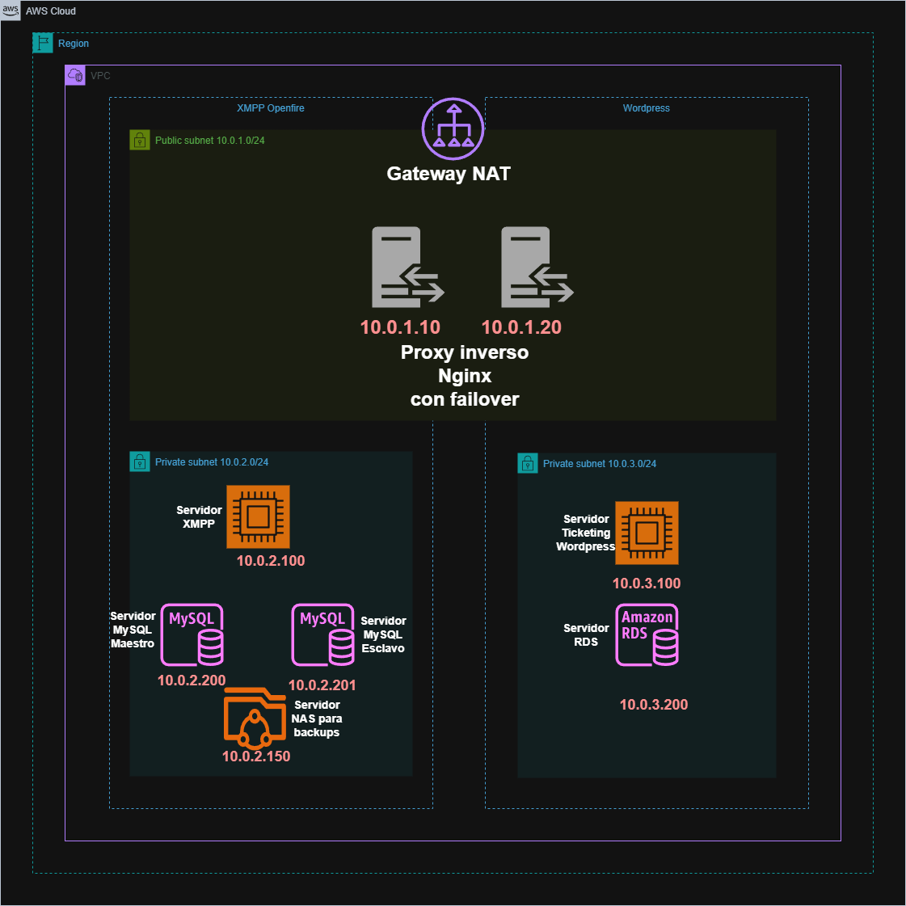

<div align="center">

# :shipit: MensAGL Equipo4(5) :shipit: 

<a href="https://github.com/jpocohuancar01/AWSCLI">
    
</a>
  <h3 align="center">💀 Reto ASIR2 2024-25 - Mensagl 💀</h3>
</div>

<div align="center">


## :memo: Descripción :memo:

</div>
El reto Mensagl tiene como objetivo la implementación de un servicio de mensajería instantánea y comunicaciones unificadas, alojado en la nube de AWS. Además, se integrará un sistema de ticketing para la gestión de usuarios y soporte técnico mediante un plugin de wordpress.


<div align="center">

## :sparkles: Objetivos :sparkles:

</div>
- Analizar tecnologías de comunicaciones unificadas y mensajería instantánea. 
- Comparar diferentes soluciones de código abierto.
- Implementar una infraestructura basada en AWS.
- Configurar un sistema de ticketing para la gestión de usuarios.
- Documentar y presentar el proyecto final.

<div align="center">

## :rocket: Tecnologías Utilizadas :rocket:

</div>

- **Cloud Computing**: Amazon Web Services (AWS). ✅
- **Protocolos de Mensajería**: XMPP y TURN. ✅
- **Bases de Datos**: MySQL. ✅
- **Seguridad**: TLS, cortafuegos, backups mediante rsync. ✅
- **Automatización**: Terraform, AWS CLI, scripts en Bash. ✅

<div align="center">

## 🚧 Arquitectura 🚧

 

</div>

- **Red en la nube (AWS)** VPC. ☁️
- **Servidores de Mensajería y Ticketing** en diferentes subredes. 🔒️
- **Proxy Inverso** para el balanceo de carga gestion de certificados y dominios. 🔐
- **Gestión de Usuarios** mediante un sistema de ticketing. 🏷️
- **Federación** entre servidores de equipos. 📱

<div align="center">

## :trollface: Instalación y Despliegue :trollface:

</div>

1. Clonar el repositorio:  
   ```bash
   git clone https://github.com/jpocohuancar01/mensagl
      ```
2. Cambiar el nombre del alumno en el script de terraform
3. Cambiar los dominios el nombre y el token utilizados en nginx.sh
4. En la linea 575 de terraform cambiar el dominio de wordpress
5. Cambiar los dominios en wordpress2.sh
6. Cambiar los dominios y certificados en configuraciones_servicios/nginx/default
7. Cambiar los dominios y certificados en configuraciones_servicios/nginx/nginx.conf
8. Cambiar la el dominio en configuraciones_servicios/wordpress/default-ssl.conf
9. Cambiar las direcciones ip en scripts_servicios/clustersql.sh
10. Cambiar las direcciones ip en scripts_servicios/backups.sh
11. Cambiar las direcciones IP y la red
12. Configurar Terraform e iniciar la infraestructura.
   ```bash
   cd AWSCLI/configuraciones_terraform
   terraform init
   terraform plan
   terraform apply
   ```
13. Comprobar conectividad y funcionalidad.

<div align="center">

## 📮 Contacto 📮

</div>

Para más información, contacta con los administradores del repositorio o consulta la documentación en el repositorio.

<div align="center">

## 💼  Integrantes 💼 
<table border="1">
    <tr>
        <th>Alejandro</th>
        <th>Jose Antonio</th>
        <th>Adrián</th>
        <th>Diego</th>
        <th>Julio</th>
    </tr>
    <tr>
        <td></td>
        <td></td>
        <td></td>
        <td></td>
        <td></td>
    </tr>
</table>
</div>
--------------------------------------------------------------------------------------------------------------------------------<br>
👷Proyecto desarrollado por estudiantes de ASIR2, curso 2024-25 👷 <br>

 

--------------------------------------------------------------------------------------------------------------------------------
